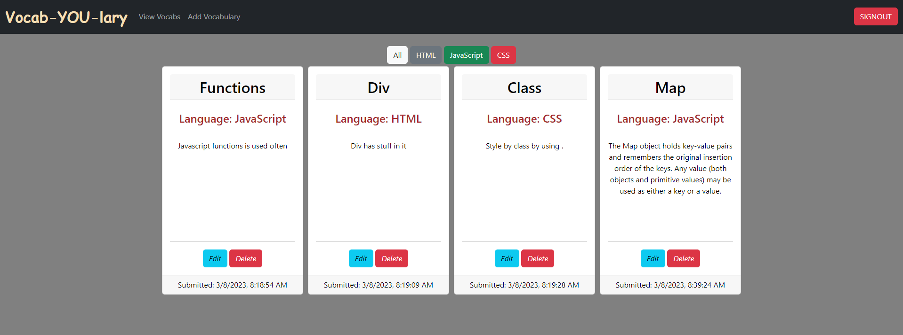
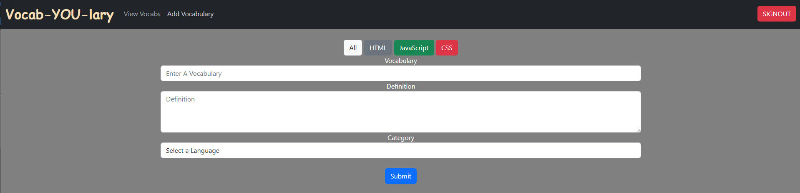

## Vocab-YOU-lary Project

## Overview of the project
Vocab-YOU-lary project allows the user to login using Google authentication and create definition cards of Tech language vocabularies. The cards that are created by the user is displayed on the homepage and the user is able to edit or delete those cards. Also, the user is able to filter the cards on the homepage based on the Tech language that they belong to.

## Link to Chie's wireframes/prototype
No wireframes were used for this project.

## Link to the deployed project

<https://mestany-vocabyoulary.netlify.app/>

## Description of the user
Any user with a google account

## List of features
* Welcome page appears with a sign on button to authenticate the user and start the app
* Homepage starts showing a navbar, filter buttons, and user's cards
* User is able to click Add Vocabulary button on the nav bar, and a form will appear to enter the new vocabulary details.
* When the user submit the new vocabulary, the homepage loads with a new card showing the new vocabulary's details.
* On each card, the user has an edit button that allows the user view the cards details and edit them if needed.
* On each card, the user has a delete button that allows the user to delete a card, and the card will disappear from the homepage.
* User can filter the cards that are on the homepage based on which Tech language they belong to
## Screenshots of the project
 Welcome Page

 Home Page

Add Vocabulary Page

## List of contributors and links to their GH profiles
<https://github.com/Mestany2>

## Link to Loom video walkthrough of the app
<....>